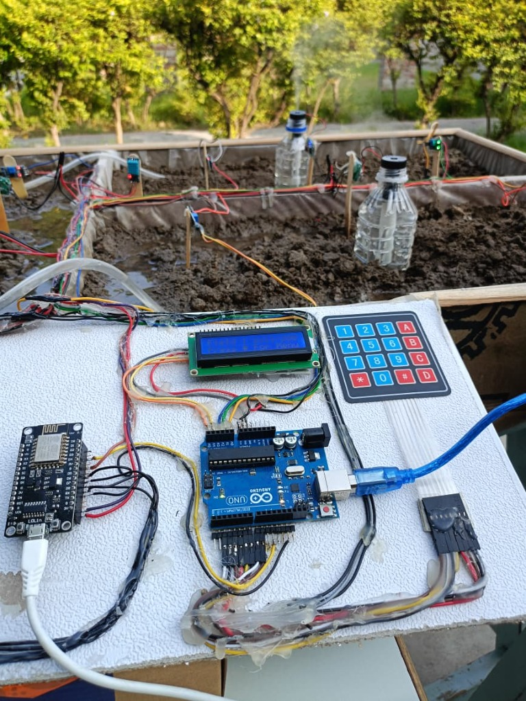
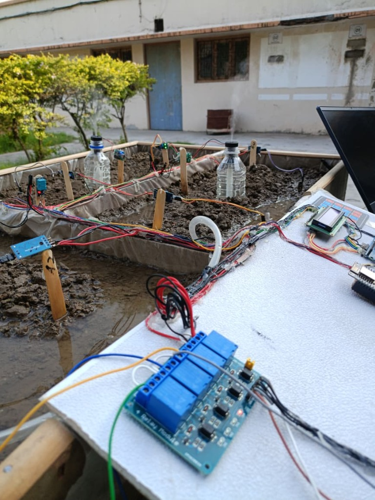
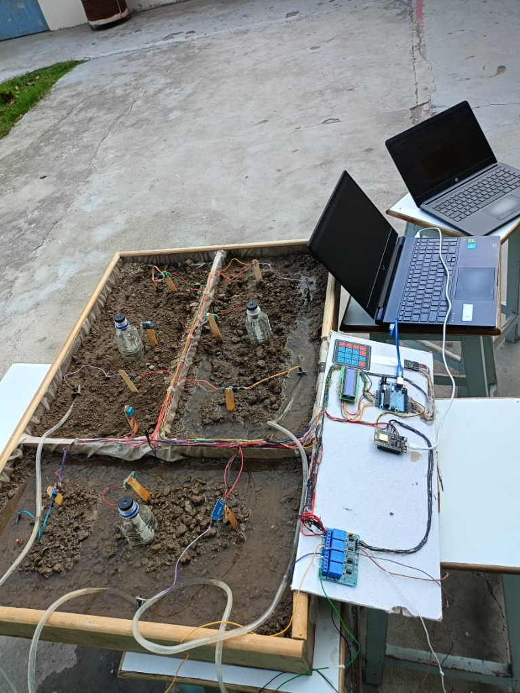
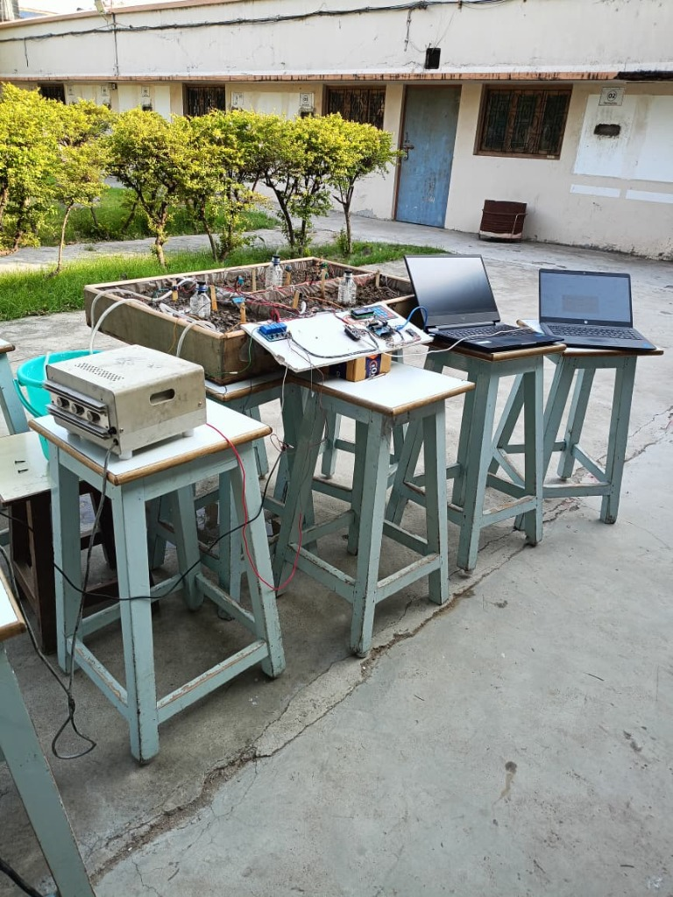

# 🌾 Smart Agriculture System — IoT, Edge ML & Azure DevOps Cloud

An end-to-end automated precision irrigation solution powered by **IoT Edge Intelligence (Arduino + NodeMCU ESP8266)**, **Embedded Machine Learning**, and **Azure Cloud Infrastructure with Azure DevOps CI/CD Pipelines**.

---

## 📸 Hardware Prototype & Testbench Gallery

| Control Board & Microcontrollers | Relays, Sensors & Mistifiers |
|:--------------------------------:|:----------------------------:|
|  |  |
| *Arduino Uno, Keypad 4x4, LCD 16x2, NodeMCU ESP8266* | *4-Channel Relay Module, Soil Sensors & Mistifiers* |

| 3-Field Prototype Topview | Complete Outdoor Experimental Setup |
|:-------------------------:|:----------------------------------:|
|  |  |
| *3 Independent Agricultural Fields with Soil & Tubing* | *Full Outdoor Bench Setup with Power Supply & Laptops* |

| Overall System Layout |
|:---------------------:|
|  |
| *Integrated Hardware, Sensors, Microcontrollers & Field Box* |

---

## 📌 Problem Statement

In modern agriculture, farmers face significant challenges in estimating exact crop water requirements. Traditional manual practices frequently cause **over-irrigation** or **under-irrigation**, leading to:
- ❌ Massive water and electricity wastage.
- ❌ Soil degradation and reduced crop yield.
- ❌ Excessive manual labor and unpredictable schedules.

### 💡 The Solution
The **Smart Agriculture System** uses field-deployed IoT sensors to monitor real-time soil moisture, ambient temperature, and humidity. Sensor inputs are processed by an **Edge Random Forest Regressor Machine Learning model** to predict the exact volume of water required (in mm of rainfall). The system then automatically calculates and triggers the precise pump execution duration for each field.

---

## 🏗️ System Architecture

```text
┌─────────────────────────────────────────────────────────────────┐
│                         FIELD LAYER                             │
│  ┌──────────┐  ┌──────────┐  ┌──────────┐                      │
│  │ Field 1  │  │ Field 2  │  │ Field 3  │  ← 3 Independent    │
│  │(Rice)    │  │(Blackgram)│ │(Cotton)  │     Fields            │
│  │Soil Pin  │  │Soil Pin  │  │Soil Pin  │  ← Soil Moisture     │
│  │+ Pump    │  │+ Pump    │  │+ Pump    │  ← Individual Pumps  │
│  │+ Mist    │  │+ Mist    │  │+ Mist    │  ← Individual Mists  │
│  └──────────┘  └──────────┘  └──────────┘                      │
└─────────────────────────────────────────────────────────────────┘
        │                                          │
        ▼                                          ▼
┌───────────────────┐                    ┌───────────────────────┐
│   Arduino Uno     │   Serial (UART)    │   NodeMCU (ESP8266)   │
│   ─────────────   │ ─────────────────► │   ─────────────────   │
│ • Keypad (4x4)    │  Field, Crop,      │ • DHT11 (Temp/Hum)   │
│ • LCD (16x2)      │  SoilMoisture      │ • ML Model (C++ Edge)│
│ • Soil Sensors    │                    │ • Pump Relay Control  │
│ • Password Auth   │                    │ • Mist Relay Control  │
│ • UI Flow         │                    │ • WiFi → Blynk Cloud  │
└───────────────────┘                    └───────────────────────┘
                                                   │
                                                   ▼
                                         ┌───────────────────┐
                                         │   Blynk IoT Cloud │
                                         │   (Dashboard)     │
                                         │ • Live Temp/Hum   │
                                         │ • Soil Moisture   │
                                         │ • Pump Status     │
                                         │ • Mist Status     │
                                         └───────────────────┘
                                                   │
                                                   ▼
                                         ┌───────────────────┐
                                         │  Azure Cloud      │
                                         │  Infrastructure   │
                                         │  (DevOps Layer)   │
                                         │ • RG, VM, VNet    │
                                         │ • CI/CD Pipeline  │
                                         │ • Model Hosting   │
                                         └───────────────────┘
```

---

## ⚙️ How The System Works

1. **Authentication & UI**: The farmer authenticates on the 4x4 Keypad connected to the Arduino Uno using a passcode. Upon validation, the farmer selects the specific Field ID (1, 2, or 3) and Crop Type via the 16x2 I2C LCD display menu.
2. **Sensor Aggregation**: Arduino reads raw analog soil moisture levels for the selected field and transmits the payload (`FieldID, CropIndex, SoilMoisture`) to the NodeMCU ESP8266 via Serial UART communication.
3. **Environmental Readings**: NodeMCU gathers ambient temperature and humidity using a DHT11 sensor.
4. **Edge ML Inference**: Features `[Temperature, Humidity, CropID]` are passed to the C++ compiled **Random Forest Regressor** running natively on the ESP8266 microcontroller.
5. **Precision Irrigation Logic**:
   - The ML model predicts rainfall requirement ($mm$).
   - Required water volume is calculated based on field dimensions ($Area \times Rainfall$).
   - Pump run time ($seconds$) = $Volume / FlowRate$.
   - If soil moisture is already sufficient (raw value $\le 400$), the pump remains **OFF**.
6. **Thermal Crop Protection**: If ambient temperature exceeds $30^\circ\text{C}$, independent mistifiers trigger automatically.
7. **Cloud IoT Dashboard**: Real-time environmental readings, soil status, mistifier state, and pump timers sync live with the **Blynk IoT Mobile Dashboard**.

---

## ☁️ Azure Cloud Infrastructure & DevOps Pipeline

The cloud deployment utilizes an enterprise-grade **Azure Cloud Infrastructure** paired with an **Azure DevOps CI/CD Pipeline** for automated model retraining, verification, and seamless service deployment.

```text
               AZURE DEVOPS CI/CD PIPELINE
 ┌─────────────────────────────────────────────────────┐
 │  GIT COMMIT / PUSH TO MAIN                          │
 └─────────────────────────┬───────────────────────────┘
                           │
                           ▼
 ┌─────────────────────────────────────────────────────┐
 │  STAGE 1: BUILD & TRAIN PIPELINE                    │
 │  • Install Python Dependencies                       │
 │  • Retrain Random Forest Model (train_edge_model.py)│
 │  • Validate Model Accuracy & Performance Metrics    │
 │  • Export C++ Header (crop_model.h) & Artifacts (.pkl)│
 └─────────────────────────┬───────────────────────────┘
                           │ (Build Success Gate)
                           ▼
 ┌─────────────────────────────────────────────────────┐
 │  STAGE 2: DEPLOY PIPELINE                           │
 │  • Secure SSH connection to Azure Ubuntu VM        │
 │  • Deploy updated Model & Flask API                │
 │  • Restart Flask Prediction Service                │
 │  • Execute API Health Check Endpoint               │
 └─────────────────────────────────────────────────────┘
```

### Key Cloud Components

#### 1. Azure Resource Group
- Logical container managing all production cloud assets for unified environment lifecycle, tracking, and cost governance.

#### 2. Virtual Network (VNet) & Subnet Isolation
- Isolated Virtual Network split into 3 segmented subnets following the principle of least privilege:
  - **App Subnet**: Hosts the prediction Flask API service.
  - **ML Subnet**: Dedicated for model training, execution, and evaluation tasks.
  - **Database Subnet**: Dedicated storage layer.

#### 3. Azure Virtual Machine (Burstable Instance)
- Ubuntu 22.04 LTS compute node with burstable CPU capability.
- Accumulates compute credits during idle periods and bursts during model retraining, minimizing cloud operational costs.

#### 4. Network Security Group (NSG) Firewall Rules
- **Port 22 (SSH)**: Strictly restricted to administrator public IP addresses.
- **Port 5000 (Flask API)**: Restrictive internal VNet traffic routing.
- **Port 443 (HTTPS)**: Secure external TLS API endpoint access.
- Enforces Zero-Trust security rules with implicit deny-all defaults.

#### 5. Automated CI/CD Pipeline (Azure DevOps)
- **Build Stage**: Automatically retrains the model, calculates performance metrics ($R^2$, $MAE$, $MSE$), compiles C++ headers for microcontrollers, and bundles build artifacts.
- **Deploy Stage**: Automated deployment to Azure VM via SSH, service restart, and API health checks.

---

## 🤖 Machine Learning & Trade-off Analysis

The system utilizes a **Random Forest Regressor** trained on agricultural datasets. We conducted a trade-off analysis comparing full sensor features vs. cost-effective limited features:

| Model Version | Features Included | R-squared ($R^2$) | MAE (mm) | Practical Viability |
|---|---|:---:|:---:|---|
| **Full Sensors Model** | N, P, K, pH, Temp, Humidity, Crop | **0.79** | 14.88 | High cost (Expensive NPK & pH sensors) |
| **Limited Sensors Model** | Temp, Humidity, Crop | **0.78** | 14.84 | **Optimal for farmers** (Affordable DHT11) |

> **Key Finding**: The limited-feature model achieves comparable accuracy ($R^2 = 0.78$) while dramatically lowering hardware costs for small-scale farmers.

---

## 📂 Repository Directory Layout

```text
Smart-Agriculture-System/
├── config/                         # System JSON configs (active_config, manual_run_flag)
├── data/                           # Datasets & evaluation matrix CSVs
│   ├── Crop_recommendation.csv
│   └── evaluation_matrix.csv
├── docs/                           # Documentation & hardware prototype images
│   └── images/
│       ├── 3_field_prototype_topview.jpg
│       ├── field_sensors_relays.jpg
│       ├── full_system_testbench.jpg
│       ├── hardware_control_board.jpg
│       └── overall_experimental_setup.jpg
├── firmware/                       # C++ Microcontroller firmware
│   ├── arduino_ui/
│   │   └── arduino_ui.ino          # Keypad, LCD & Soil Sensor reading UI
│   └── node_mcu_client/
│       ├── crop_model.h            # Exported pure C++ ML model header
│       └── node_mcu_client.ino     # ESP8266 WiFi, Blynk & Edge inference client
├── models/                         # ML Model Binaries & Headers
│   ├── crop_mapping.pkl
│   ├── crop_model.h
│   ├── crop_water_model.pkl
│   └── edge_rf_model.pkl
├── reports/                        # Visual graphs & performance matrices
│   ├── actual_vs_predicted_matrix.png
│   ├── correlation_matrix.png
│   ├── model_comparison.png
│   └── residual_error_matrix.png
├── src/                            # Python Core Scripts
│   ├── compare_models.py           # Model trade-off analysis
│   ├── generate_plots.py           # Evaluation plots generator
│   ├── predict.py                  # CLI simulation tool
│   ├── pump_time_converter.py      # Water volume to pump run-time calculator
│   ├── train_edge_model.py         # Trains & exports C++ Edge ML model
│   └── train_model.py              # Full Python ML pipeline trainer
├── README.md                       # Comprehensive Documentation
└── requirements.txt                # Python Dependencies
```

---

## 🛠️ Quick Start & Execution

### 1. Install Dependencies
```bash
pip install -r requirements.txt
```

### 2. Train Edge Model & Export C++ Header
```bash
python3 src/train_edge_model.py
```
*Generates `models/crop_model.h` and updates `firmware/node_mcu_client/crop_model.h`.*

### 3. Train Full Model Pipeline & Evaluate
```bash
python3 src/train_model.py
```
*Saves `models/crop_water_model.pkl` and `data/evaluation_matrix.csv`.*

### 4. Interactive Simulation CLI
```bash
python3 src/predict.py
```

### 5. Generate Evaluation Graphs & Reports
```bash
python3 src/compare_models.py
python3 src/generate_plots.py
```

---

## 📜 License & Acknowledgments
Developed as an advanced academic project integrating IoT Hardware, Machine Learning, and Azure DevOps Infrastructure.


